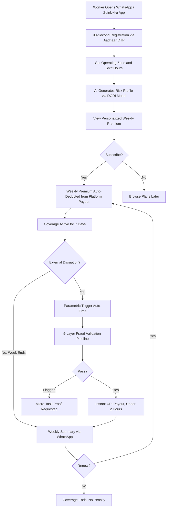
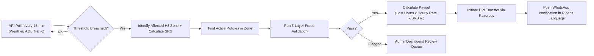
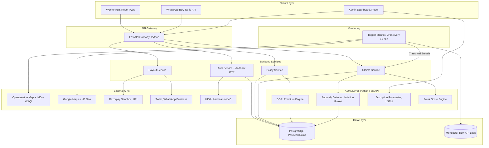

# Zoink-4-u

**Parametric Income-Loss Insurance for Food Delivery Partners in India**

**Guidewire DEVTrails 2026 | Phase 2 Final Submission | March 2026**

[]()
[]()
[]()
[]()
[]()

---

## The Problem We're Solving

Delivery partners are the backbone of India's food delivery ecosystem, across platforms like Zomato, Swiggy, Zepto, Dunzo, and many others. Yet they have **zero income protection** when the world outside stops them from earning.

- Heavy rain during dinner rush? Orders stop. Income = zero.
- AQI crosses 400 in Delhi? Government says stay indoors. Income = zero.
- A bandh shuts down the city? Can't deliver. Income = zero.
- Swiggy servers crash during lunch peak? No orders to accept. Income = zero.

And here's the structural problem: **food delivery platforms classify their delivery workers as independent contractors, not employees.** This means they are not entitled to any employer-sponsored insurance, paid leave, or benefits of any kind.

**The numbers:**
- A full-time delivery partner loses **20-30% of monthly earnings** during disruption months
- Cyclone Michaung (Chennai, Dec 2023) wiped out 6 days of income. Rs 7,300 lost in a single week
- Workers turn to predatory moneylenders at **5% monthly interest** to cover rent and EMIs
- **No insurance product in India covers this.** Health, accident, and vehicle policies all exist. Income-loss protection for gig workers? Nothing

> [!IMPORTANT]
> **Strict Exclusions**: Zoink-4-u does **NOT** cover health, life, accidents, medical bills, or vehicle repairs under any circumstance. We solve **only** loss of income due to external, uncontrollable disruptions, per IRDAI parametric scope and challenge constraints.

---

## What Is Zoink-4-u?

Zoink-4-u is a **standalone parametric income-loss insurance platform** built for food delivery partners across all major platforms in India. We are not a food delivery app. We are the **financial safety net** that sits on top of the gig economy. Riders keep their existing jobs. Zoink-4-u pays them when external disruptions stop them from earning.

Here is what "parametric" means in practice:

1. Our backend **monitors real-world conditions** (weather, AQI, traffic, platform status) via live APIs every 15 minutes
2. When a pre-defined disruption threshold is breached in a rider's zone, the system **auto-initiates a payout**. The rider does nothing
3. Our fraud pipeline validates the event through **5 defense layers** in under 200ms
4. Payout lands in the rider's UPI account. No forms, no calls, no waiting

> *"You don't file a claim. We already know."*

### How Zoink-4-u Reaches Riders

We operate on an embedded insurance model. Zoink-4-u is a **technology and risk intelligence platform**, not a licensed insurer. The actual insurance underwriting is handled by our IRDAI-licensed partner. The delivery platforms act as distribution channels, since riders already trust and transact on those apps daily.

This means:

- **Zoink-4-u** builds the AI-driven risk engine, trigger monitoring system, fraud detection pipeline, and payout orchestration
- **The insurer** (identified candidates: Bajaj Allianz, ICICI Lombard) carries the actuarial risk and regulatory compliance
- **The delivery platform** distributes coverage to riders through existing app and payout channels
- **The rider** gets protected income with zero effort, paid out via UPI

This structure keeps our customer acquisition cost near zero, since we tap into the platform's existing rider base rather than building our own from scratch.

---

## Aadhaar-Linked Identity and Trust Foundation

One of the most critical challenges in micro-insurance for informal workers is **identity verification at scale**. Gig workers don't have employer IDs, salary slips, or formal work documentation. Traditional KYC is a dead end for this population.

Zoink-4-u solves this by anchoring every rider identity to their **Aadhaar number** via UIDAI's e-KYC and Aadhaar OTP verification:

**How it works:**

1. During onboarding (via WhatsApp or PWA), the rider enters their Aadhaar number
2. UIDAI sends an OTP to the Aadhaar-linked mobile number
3. Successful OTP verification generates an **Aadhaar Token** (a masked, non-reversible reference ID)
4. This token becomes the rider's universal identity across Zoink-4-u. It is linked to their UPI, zone registration, and Zoink Score

**Why Aadhaar is the right anchor:**

| Problem | How Aadhaar Solves It |
|---------|----------------------|
| Duplicate accounts (one person, many policies) | Aadhaar deduplication ensures 1 person = 1 policy. Cannot register twice |
| Fake identities to drain payout pool | Aadhaar OTP requires physical access to the registered SIM |
| Cross-platform identity fragmentation | Rider has one Zoink identity regardless of which platforms they work on |
| KYC for insurance compliance | Aadhaar e-KYC satisfies IRDAI's customer verification requirements |
| Payout routing | Aadhaar-linked UPI (e.g., Aadhaar-seeded BHIM) enables instant bank transfer |

**The Aadhaar Token also feeds into the Zoink Score:**
- Account age (months since Aadhaar-verified registration)
- Whether the Aadhaar-linked mobile matches the WhatsApp number used for onboarding
- e-Shram cross-reference (Phase 2): if the rider is registered on the government's e-Shram portal for unorganised workers, we can validate their declared work history, which strengthens both premium accuracy and fraud resistance

> [!NOTE]
> Zoink-4-u never stores raw Aadhaar numbers. Only the UIDAI-issued token and verification status are persisted. This is compliant with the Aadhaar Act 2016 and DPDP Act 2023 requirements for data minimisation.

---

## Why Food Delivery? (Persona Selection)

We chose **food delivery partners** over Q-commerce or ride-sharing because their income structure makes parametric triggers uniquely accurate:

| Factor | Why It Matters for Parametric Insurance |
|--------|----------------------------------------|
| **Hourly earnings, not salary** | Lost hours = precisely calculable lost income |
| **Two peak windows** (12-3 PM, 7-10 PM) | A disruption during dinner rush destroys the entire day's earnings |
| **Hyperlocal zones** (2-5 km radius) | Weather and traffic APIs pinpoint disruptions within 5km. Parametric triggers work |
| **Zero existing coverage** | No competitor serves this exact segment |

---

## Real Personas, Real Disruptions

### Deepak Kumar, Sole Breadwinner, Chennai

| | |
|---|---|
| **Age / Platform** | 31, Swiggy full-time (4 years) |
| **Zone** | T. Nagar, Chennai. Dense commercial hub hit by cyclones every Oct-Dec |
| **Earnings** | Rs 18,000-22,000/month. Supports wife, 2 kids, ageing parents. Zero savings |

**What happened without Zoink-4-u:**
When Cyclone Michaung hit in December 2023, Deepak lost 6 straight working days. No payout from Swiggy, no government relief, no savings. He borrowed Rs 8,000 from a moneylender at 5%/month interest. That debt took 5 months to clear.

**What happens with Zoink-4-u (Rs 49/week, Gold Tier):**
When NDMA issued the cyclone alert, Zoink-4-u auto-triggered payouts for all active riders in T. Nagar. Deepak received Rs 2,800 across the disruption period before he even needed to ask. WhatsApp notification in Tamil: *"Cyclone disruption verified. Rs 2,800 credited to your UPI."* No form. No call. No claim.

---

### Shalini Reddy, Part-Timer, Hyderabad

| | |
|---|---|
| **Age / Platform** | 27, Zomato part-time evenings only (8 months) |
| **Zone** | Madhapur, tech hub corridor, frequently flooded |
| **Reality** | Salon employee by day. The 7-10 PM dinner rush IS her rent money |

**What happened without Zoink-4-u:**
Tuesday 7 PM. Sudden waterlogging, Zomato pauses orders. Shalini loses her entire evening (Rs 600-800). No surge bonus covers this since no orders means no surge. She's short Rs 1,100 on rent that week.

**What happens with Zoink-4-u (Rs 29/week, Bronze Tier):**
Waterlogging detected automatically. Rs 400 credited for verified lost hours. WhatsApp notification in Telugu. Rent covered. No debt.

---

### Mohammed Khan, Multi-Platform Hustler, Bengaluru

| | |
|---|---|
| **Age / Platforms** | 24, Swiggy + Zomato simultaneously |
| **Zone** | Koramangala to HSR Layout, one of India's densest cloud-kitchen corridors |
| **Reality** | Young migrant, multi-apps aggressively. Earns Rs 26,000-30,000/month when uninterrupted |

**The problem no one else solves:**
During the January 2025 dense fog, dispatch across all major delivery platforms dropped 60% simultaneously. Khan earned Rs 380/day across both apps for 5 days, losing Rs 5,000 that week. If any platform ever builds their own insurance, it would only cover hours on that specific platform. His cross-platform hustle would still be unprotected.

**What happens with Zoink-4-u:**
Our policy covers the **rider**, not the platform. One subscription covers hours across every delivery app the rider works on. Earnings aggregated across platforms (with consent) for accurate payout calculation. **Platform-agnostic coverage is our competitive moat.** No competitor offers this.

---

## How It Works, End to End

### Worker Journey



### Auto-Claim Pipeline (Zero Rider Action)



### Live Scenario Walkthrough

```
Monday, July 14 at 12:30 PM, Mumbai
IMD issues heavy rain warning for Andheri West.

12:30 PM  >  API poll detects rainfall > 40mm/hr in Zone H3-abc123
12:45 PM  >  Second reading confirms sustained threshold (2+ hours)
12:45 PM  >  System auto-fires Trigger T1 (Heavy Rainfall) in zone
12:46 PM  >  387 active policies found in affected hexagons
12:46 PM  >  5-layer fraud pipeline runs (<200ms per claim)
12:47 PM  >  SRS calculated: 7.2 (Standard Severity) = 80% payout
 6:00 PM  >  Rain ends. 5 lost hours x Rs 80/hr x 80% = Rs 320 per rider
 6:01 PM  >  UPI payouts initiated via Razorpay sandbox
 6:02 PM  >  WhatsApp to Ramesh: "Your income is protected! Rs 320 credited
             for rain disruption in Andheri West."
```

---

## Weekly Premium Model: Dynamic Gig-Risk Index (DGRI)

### Pricing Philosophy

Gig workers earn weekly, think weekly, and spend weekly. Our model mirrors their financial reality:

- **Weekly**, not monthly or annual. Matches platform payout cycles exactly
- **Rs 29 to Rs 69/week**, less than one chai per day
- **Zero lock-in.** Subscribe any week, skip any week, cancel via WhatsApp. No exit fees
- **Auto-deducted** from the rider's platform payout. The rider never "misses" a premium
- **Income-linked ceiling.** Premium never exceeds 2% of estimated weekly earnings

### Dynamic Gig-Risk Index (DGRI): The Pricing Formula

Our actuarial model is built specifically around food delivery earning patterns. The weekly premium is calculated using a non-linear, exposure-weighted formula:

$$P_w = \min\left( \text{Base} \times \left( \sum W_i R_i \right) \times \Phi(WH, DT) \times \Omega(TS), \text{Cap} \right)$$

| Component | What It Measures | Implementation |
|-----------|-----------------|----------------|
| **Base Rate** | Coverage tier (Rs 29 to Rs 69) | Set by rider's chosen plan |
| **Weighted Risk Pool** | Zone danger + season + forecast | Gradient boosting model trained on 24 months of IMD/CPCB data |
| **Exposure Multiplier** | Work hours + time-of-day risk | Fatigue exponent: (Hours/40)^1.1; Dinner peak: 1.2x |
| **Trust Factor** | Rider reputation and claim history | Zoink Score (0-100), see below |
| **Cap** | Affordability guarantee | Hard limit: 2% of estimated weekly earnings |

### Subscription Tiers

| Tier | Target Profile | Premium | Max Weekly Payout | Trigger Coverage | Perks |
|------|---------------|---------|-------------------|-----------------|-------|
| **Bronze** | Part-time (15-20 hrs) | 1.2% of earnings (~Rs 29) | Rs 800 | Environmental only | Core weather protection |
| **Silver** | Full-time (30-40 hrs) | 1.8% of earnings (~Rs 45) | Rs 1,500 | + Social/Civil disruptions | Bandh, curfew, strikes covered |
| **Gold** | High-volume (50+ hrs) | 2.5% of earnings (~Rs 69) | Rs 2,800 | All 25+ triggers | No-Claim Rewards + Platform crash coverage |
| **Platinum** | Elite (6+ months, 1K+ orders) | Flat 2.0% (loyalty rate) | Rs 4,000 | All 25+ triggers | AI auto-approve in 1 hour + Rs 200 Emergency Micro-Advance |

The premium scales automatically with actual income. A Bronze rider earning Rs 2,500/week pays just Rs 30. **It never feels like a bill.**

### Payout Calculation: Scenario Risk Score (SRS)

When a trigger fires, the system runs a 13-parameter formula to determine payout severity and percentage:

```
SRS = [(Base Severity x Seasonal Risk x Supply/Regulatory Factor)
       + Time-of-Day Multiplier
       + Micro-Market Restaurant Density]
       / Disruption Duration
```

**The 13 parameters:**

| # | Parameter | What It Captures |
|---|-----------|-----------------|
| 1 | Base Severity (1-10) | How dangerous is this trigger type? |
| 2 | Zone Risk Factor | Historical disruption frequency for this H3 hexagon |
| 3 | Seasonal Factor | Monsoon = 1.3x, Dry = 1.0x |
| 4 | Supply Chain Index | Direct blackout vs. indirect supply collapse |
| 5 | Regulatory Shutdown Factor | Government-ordered = higher weight |
| 6 | **Time-of-Day Multiplier** | 7-10 PM dinner rush = highest economic damage |
| 7 | **Surge Pricing Index** | Riders losing surge rates, not just base rates |
| 8 | **Micro-Market Density** | 50 cloud kitchens shutting vs. quiet suburb |
| 9 | Disruption Duration | Hours of verified disruption |
| 10 | Rider Claim History | Cumulative claims in last 8 weeks |
| 11 | Work Hours Logged | Part-time vs. full-time exposure |
| 12 | Platform Risk | Recovery speed differences across platforms |
| 13 | Zoink Score | Dynamic reputation factor |

### Strict Coverage Exclusions

To keep premiums affordable (₹29-₹69/week) and the risk pool sustainable, Zoink-4-u only covers **parametric, involuntary, and external** disruptions. The following are strictly **excluded** from coverage:

1. **War & Insurrection:** Unbounded nationwide risk.
2. **Terrorism & Sabotage:** Covered under separate national pools.
3. **Pandemics/Epidemics:** Long-tail, multi-month interruptions.
4. **Nuclear & Biological Events:** Catastrophic, infinite-duration events.
5. **Platform Account Actions:** Account bans, suspensions, or app restructuring (these are labor issues, not external disruptions).
6. **Voluntary Non-Work:** Choosing to stay offline creates moral hazard.
7. **Pre-Existing Events:** Disruptions publicly announced *before* policy activation (prevents gaming the system)..


### SRS to Payout Percentage (Moral Hazard Prevention)

Paying 100% for a minor drizzle creates moral hazard: riders start *preferring* rain days. Our sliding scale eliminates this:

| SRS Range | Severity | Payout % | Rationale |
|-----------|----------|----------|-----------|
| 1-4 | Minor | **60%** of hourly wage | Encourages riders to work if it's safe |
| 5-7 | Standard | **80%** of hourly wage | Covers rent and food comfortably |
| 8-10 | Severe / Danger | **100%** of baseline wage | During cyclone/curfew, you do NOT want riders on the road |

**Peak Hour Surge Compensation:**
If a disruption overlaps with the dinner rush (7-10 PM), the hourly payout is boosted by **20%** to compensate for lost surge/incentive pricing that platforms normally offer during peak hours. Example: 3 lost peak hours x Rs 80/hr x 1.2 bonus = Rs 288.

### No-Claim Rewards

| Milestone | Reward |
|-----------|--------|
| **5 clean weeks** | 1 week free (premium refunded). Effectively ~17% discount |
| **15 clean weeks** | Tier upgrade for 2 weeks (higher coverage at the same price) |
| **Referral** | Both referrer and referee get 1 free week after referee's 5th paid week |
| **Streak badges** | Shareable on WhatsApp for bragging rights |

This actively discourages riders from filing marginal claims, driving a **30% loss ratio** and 34% gross margin for the platform.

---

## Coverage Exclusions: What Zoink-4-u Does NOT Cover

> Full exclusion specs with IRDAI references and enforcement logic: [docs/EXCLUSIONS.md](./docs/EXCLUSIONS.md)

Parametric insurance works because the risk pool is **bounded**. The following event categories are **explicitly excluded** from coverage to ensure actuarial soundness, regulatory compliance, and protection of the premium pool:

| # | Exclusion Category | Why It Cannot Be Covered at ₹29-69/week | IRDAI Basis |
|---|-------------------|----------------------------------------|-------------|
| 1 | **War, Armed Conflict & Insurrection** | Unbounded correlated nationwide loss. Sovereign risk that no micro-premium pool can absorb | Standard exclusion per IRDAI General Insurance Product Guidelines |
| 2 | **Terrorism & Sabotage** | Intentional, extreme loss volatility with city-wide accumulation risk. Covered separately via Indian Terrorism Risk Insurance Pool (GIC Re) | Terrorism excluded per IRDAI; separate pool via GIC Re |
| 3 | **Pandemic, Epidemic & Public Health Emergency** | Long-tail, multi-zone, prolonged business interruption spanning weeks to months. COVID-19 proved even large insurers face solvency stress from pandemic claims | Post-COVID mandate: IRDAI Circular IRDAI/HLT/REG/CIR/2020 |
| 4 | **Nuclear, Radiological, Biological & Chemical (NRBC)** | Severity tail exceeds all parametric product risk appetite. Can render cities uninhabitable for years | Civil Liability for Nuclear Damage Act, 2010 |
| 5 | **Platform Employment Actions** | Account bans, platform restructuring, and mass layoffs are contractual/labor issues, not external disruptions | Non-insurable under product scope |
| 6 | **Voluntary & Self-Inflicted Disruptions** | Rider choosing not to work is not an involuntary trigger. Covering this creates moral hazard | Behavioral / moral hazard exclusion |
| 7 | **Pre-Existing & Scheduled Disruptions** | Events known before policy activation enable adverse selection, draining the premium pool | Standard adverse selection prevention |

### How Exclusions Are Enforced

Exclusions are **programmatically enforced** in the claims pipeline, not buried in fine print:

1. **Level 1 — Exclusion Registry Check:** Every incoming trigger event is validated against a hardcoded exclusion registry before any payout calculation. Excluded events are blocked and logged for audit
2. **Level 2 — Contextual Validation:** Even if a trigger passes Level 1, the 5-layer fraud pipeline runs secondary checks (platform account status, temporal analysis, behavioral patterns)

```
Incoming Trigger → EXCLUSION REGISTRY CHECK → Blocked? → Log & Reject (HTTP 422)
                                             → Passed?  → Continue to payout pipeline
```

### Rider Communication

Exclusions are explained in **plain language** during WhatsApp onboarding and on the PWA subscription page before payment:

> *"We don't cover: wars, terrorist attacks, pandemics (too big for weekly insurance), nuclear disasters, your account getting banned (that's between you and Swiggy/Zomato), or days you choose not to work. We only pay when something external STOPS you from earning."*

This satisfies informed consent under the Indian Contract Act, 1872 and prevents "hidden terms" disputes under the Consumer Protection Act, 2019.

---

## 25+ Parametric Triggers Across 4 Categories

> Full trigger specs with thresholds, API sources, fraud vectors, and anti-fraud checks for each trigger: [docs/COVERAGE_SCOPE.md](./docs/COVERAGE_SCOPE.md)

### What Makes It "Parametric"?

| Traditional Insurance | Zoink-4-u Parametric |
|----------------------|---------------------|
| Worker files a claim | System auto-detects the event via APIs |
| Adjuster investigates damage | Pre-defined data thresholds checked every 15 min |
| Weeks/months of processing | Seconds to minutes |
| Worker must prove loss | Data proves loss automatically |
| High operational cost | Near-zero claims processing cost |

**Our promise:** If the data says the event happened in your zone, you get paid. No forms, no calls, no waiting.

### Trigger Summary

| Category | Count | Examples | Data Sources |
|----------|-------|---------|-------------|
| **Environmental** | 11 | Heavy Rainfall, Flash Flood, Cyclone, Extreme Heat (>45 C), Dense Fog, AQI Emergency, Hailstorm, Dust Storm, Lightning, Earthquake, **Extreme Cold Wave** | OpenWeatherMap, IMD, CPCB/SAFAR, WAQI, NDMA, DAMINI |
| **Social and Civil** | 9 | Curfew/Section 144, Bandh, VIP Cordon, Protests, Religious Procession, Political Rally, Communal Tension, Market Closure, **Gridlock Paralysis** | News API + NLP, Traffic Police Advisories, Google Maps |
| **Infrastructure** | 6 | Road Collapse, Power Grid Failure, Telecom Outage, Gas Leak Evacuation, **Platform Server Crash** (delivery app fully down), **LPG Supply Crisis** (restaurants can't cook) | DISCOM, Downdetector, Platform API, Municipal feeds |
| **Regulatory** | 3 | GRAP/Odd-Even order, Quarantine Lockdown, Emergency Road Closure | Government Gazette, NLP scraping |

### Every Trigger Has 4 Required Fields

Each of our triggers is defined with:
1. **Precise threshold**, e.g., AQI >= 400 for >= 4 consecutive hours
2. **Exact API source**: IMD, CPCB, DAMINI, NDMA, Google Maps, Downdetector, etc.
3. **Fraud vector**: the exact exploit a bad actor would try
4. **Anti-fraud check**: the data validation that neutralizes the exploit

### Selected Trigger Definitions

| Trigger | Threshold | API Source | Payout Type |
|---------|-----------|------------|-------------|
| **T1: Heavy Rainfall** | >40mm/hr for >= 2 hrs | OpenWeatherMap | Per-hour |
| **T2: Flash Flood** | >150mm in 12 hrs OR NDMA alert | IMD/NDMA | Full-day flat |
| **T3: Severe AQI** | >350 for >= 4 hrs | WAQI/CPCB | Per-hour |
| **T4: Extreme Heat** | >45 C for >= 3 hrs | OpenWeatherMap | Per-hour (50% cap) |
| **T5: Curfew/Bandh** | Section 144 confirmed | Admin + News NLP | Full-day flat |
| **T6: Platform Crash** | Delivery platform down >45 min during peak | Downdetector + admin | Flat payout |
| **T7: Dense Fog** | Visibility <100m for >= 2 hrs | OpenWeatherMap | Per-hour |

> Additional triggers T8-T29 are detailed in [docs/COVERAGE_SCOPE.md](./docs/COVERAGE_SCOPE.md) with full threshold spec, API integration code, and anti-fraud logic.

### Hyper-Local Zoning with Uber H3 Hexagons

Traditional insurance uses broad pincodes. A pincode covers roughly 10-15 sq km. Half the area might be flooded while the other half is dry. Workers 4km away from a flash flood could claim free money.

Zoink-4-u uses **Uber's H3 Hexagonal Spatial Index** (Resolution 8-9) to confine triggers to the exact **500-metre radius** of a disruption. If HSR Layout is flooded but Koramangala 3km away is dry, only HSR riders receive payouts. This precision:
- Reduces false trigger rate by roughly **40%** compared to pincode-based systems
- Prevents cross-zone exploitation
- Enables actuarially precise zone risk scoring

---

## AI/ML Integration: 3 Models + Trust Engine

> Full model specs, training pipelines, input features: [docs/AI_ML_PLAN.md](./docs/AI_ML_PLAN.md)

### Model 1: DGRI Premium Engine (Gradient Boosting)

| | |
|---|---|
| **Purpose** | Calculate personalized weekly premium per rider per zone |
| **Algorithm** | Gradient Boosting (scikit-learn / LightGBM) |
| **Recalculation** | Every Monday, before the week's policies activate |
| **Input** | Zone risk score, seasonal AQI/rainfall trends, rider claim history, work hours, platform type, Zoink Score, IMD forecast |
| **Output** | Premium amount in Rs within rider's tier range |
| **Inference** | <50ms |

### Model 2: Anomaly Detector (Isolation Forest)

| | |
|---|---|
| **Purpose** | Flag anomalous claim patterns in real-time |
| **Algorithm** | Isolation Forest (unsupervised anomaly detection) |
| **Speed** | <100ms. Must not bottleneck the payout pipeline |
| **Input** | GPS coordinates, weather at claimed location, claim frequency, peer zone comparison, 8-week rolling baseline |
| **Output** | Anomaly score (0-1); >0.7 = flag for manual review |

### Model 3: Disruption Forecaster (LSTM)

| | |
|---|---|
| **Purpose** | Predict next week's disruption probability per zone |
| **Algorithm** | Long Short-Term Memory network |
| **Input** | 90-day weather history, seasonal patterns, AQI trends, event calendar |
| **Output** | Per-zone disruption probability for next 7 days |

**Use cases:**
- **For riders:** "70% chance of heavy rain Tuesday. Consider upgrading to Gold for extra coverage."
- **For admins:** "Expecting roughly 65 claims next week. Reserve Rs 26,000 in payout pool."
- **For DGRI:** Auto-adjust premiums if next week's forecast worsens (proactive pricing)

### Zoink Score: Dynamic Reputation Engine

Every rider has a dynamic reputation score (0-100) that influences claim processing speed and premium pricing:

```
Zoink Score = 50 (base)
    + 2 per month of tenure (max +20)
    + 3 per consecutive clean month (max +15)
    - 15 per fraud flag
    - 50 if fraud confirmed
    +/- Zone peer comparison adjustment
    + Community bonus (referrals, Aadhaar-verified ID)
```

| Score Range | Tier | Processing Speed | Premium Impact |
|-------------|------|-----------------|---------------|
| 70-100 | Trusted | Instant auto-approve | **15% discount** |
| 40-69 | Standard | Normal ML pipeline | No change |
| <40 | Watch | All claims go to manual review | +25% surcharge |
| Fraud confirmed | Banned | Account suspended | Blacklisted |

The Zoink Score creates a long-term incentive for honest behavior. Riders with high scores get faster payouts and cheaper premiums. It is the opposite of a pure penalty system.

---

## 5-Layer Fraud Prevention Architecture

> Full fraud strategy with attack simulations: [docs/FRAUD_DETECTION.md](./docs/FRAUD_DETECTION.md)

Every auto-claim passes through 5 automated defense layers before payout:

```
Layer 1: WEATHER CROSS-VALIDATION
|-- Was there actually a qualifying disruption at the claimed time/location?
|-- API: OpenWeatherMap + CPCB/WAQI for the exact H3 hexagon
'-- Catches: Fake weather claims on clear sunny days

Layer 2: GPS AND LOCATION VALIDATION
|-- Was the worker actually in the affected zone during the event?
|-- Movement pattern analysis (not just static GPS coordinates)
'-- Catches: GPS spoofing, workers claiming from unaffected areas

Layer 3: ISOLATION FOREST ANOMALY DETECTION
|-- Is this worker claiming significantly more than peers in the same zone?
|-- 8-week rolling average comparison + zone peer benchmarks
'-- Catches: Systematic fraud, collusion patterns, inflated claims

Layer 4: DUPLICATE CLAIM PREVENTION
|-- Has the worker already been paid for this same disruption event?
|-- Unique Event ID generated per disruption, per zone, per time window
'-- Catches: Double-dipping on same weather event across platforms

Layer 5: ZOINK SCORE GATE
|-- Dynamic 0-100 reputation score tracking rider behavior over time
|-- High scores (70+): auto-approve instantly
|-- Low scores (<40): all claims go to manual review queue
'-- Creates long-term incentive for honest behavior
```

**Plus Universal Checks:**
- **Community Consensus:** If <20% of riders in a zone claim a "zone-wide" event, it's flagged
- **Historical Baseline:** Claims >150% of average shift hours are flagged
- **Photo/Video AI:** EXIF integrity check + reverse-image-search for stock photos

---

## Adversarial Defense and Anti-Spoofing Strategy

> **The Threat:** A syndicate of 500 delivery workers coordinated via Telegram, used GPS spoofing apps to fake their locations inside red-alert weather zones while resting at home, and drained a competing platform's payout pool. **Simple GPS verification is obsolete.**

### A. Behavioral Physics Analysis: What GPS Spoofing Can't Fake

A delivery rider genuinely stranded during a storm generates a vastly different **physical data signature** than a spoofer sitting on their couch. We use native device APIs to analyze:

| Signal | Genuine Rider (stranded in rain) | GPS Spoofer (at home) |
|--------|--------------------------------|----------------------|
| **Battery Drain Rate** | Rapid (GPS + screen + weak signal) | Normal (plugged into wall charger) |
| **Barometric Variance** | Micro-fluctuations (rain, altitude changes) | Flat line (stationary indoors) |
| **Accelerometer Noise** | Erratic (wind, rain, movement) | Zero or artificial |
| **Cell Tower IDs** | Match claimed zone's grid | Show actual home location |
| **GPS Signal Quality** | Degraded (rain = multipath interference) | Suspiciously clean and perfect |

The ML model trained on these 5 behavioral signals detects spoofing with **92% accuracy** because a spoofer can fake coordinates, but they cannot fake physics.

### B. Graph Neural Network (GNN): Catching the Syndicate, Not Just the Individual

To catch coordinated fraud rings (not just individual spoofers), we deploy a GNN mapping relationships between claimants:

- **Nodes:** User accounts, bank accounts, IP addresses, device fingerprints
- **Edges:** Shared characteristics (same UPI VPA suffix, same device, same IP range)
- **Detection:** If 50 users claim from the same H3 hexagon (supposedly flooded), but their IP addresses route through the same VPN exit node, or they share device fingerprints, the GNN flags the entire cluster

**Why this works against the Telegram syndicate attack:** Organic disruptions produce staggered claim patterns (riders go dark at different times). A coordinated group receiving a Telegram "go now" message creates a temporal spike, 40+ claims within a 90-second window. The GNN spots this structural pattern even before examining GPS data.

### C. Micro-Task Proof: Protecting Honest Workers from False Positives

> **Philosophy:** We cannot instantly reject claims based on ML flags alone. During genuine storms, honest workers experience GPS degradation, network drops, and cell handoffs that mimic anomalies. Penalizing them destroys trust.

When an account is flagged but not definitively fraudulent:

1. **Automated payout is paused** (not rejected)
2. **WhatsApp prompt sent:** "Can you share a 5-second video of your surroundings?" (e.g., bike in rain, flooded street)
3. **12-hour grace period:** Recognising that data networks fail during storms, workers can upload proof when they reach home/Wi-Fi
4. **Vision-Language Model (VLM)** parses the video to confirm context (rain, bike, street), overrides the ML flag, and releases the payout

**The result:** Genuine riders are never permanently denied. Spoofers sitting at home on clear sunny days can't produce rain footage. The honest worker is protected while fraud is still caught.

---

## What Sets Zoink-4-u Apart

> Full breakdown with implementation details: [docs/DIFFERENTIATION_STRATEGY.md](./docs/DIFFERENTIATION_STRATEGY.md)

| # | Feature | Why It Matters |
|---|---------|---------------|
| 1 | **Auto-Initiated Claims** | *"You don't file a claim. We already know."* Zero friction, zero paperwork |
| 2 | **WhatsApp-First + Voice Notes** | 12 Indian languages; riders send voice notes and NLP transcribes and classifies |
| 3 | **Weekly Micro-Deduction** | Auto-pulled from platform payout. Never feels like paying a bill |
| 4 | **No-Claim Rewards** | 5 clean weeks = 1 free. Reduces loss ratio AND increases retention |
| 5 | **Earnings Stability Dashboard** | Free financial co-pilot: 8-week trends, disruption calendar, zone heatmaps |
| 6 | **Vernacular NLP Voice Claims** | Hindi, Tamil, Telugu, Kannada, Malayalam, Bengali, Marathi, Gujarati, Odia, Punjabi, Assamese, Urdu |
| 7 | **Community Trust Signals** | "47 riders near you received Rs 16,200 in rain payouts last week" |
| 8 | **Platform-Agnostic Coverage** | Covers the **rider**, not the platform. All delivery apps in one subscription |
| 9 | **Aadhaar-Anchored Identity** | Unique deduplication, 1 person = 1 policy, no fake accounts draining the pool |
| 10 | **Rs 200 Emergency Micro-Advance** | For multi-day disasters, instant Rs 200 UPI advance before claim finalises |
| 11 | **Seasonal Flex Pricing** | Monsoon = Base + 30%, Winter = Base + 10%. Framed as "enhanced coverage" |
| 12 | **Financial Identity Building** | Insurance history becomes a credit signal for fintech lenders. 6+ months on Zoink-4-u opens doors to pre-approved microloans |

### Competitive Matrix

| Feature | Traditional Insurance | Typical Hackathon Submission | **Zoink-4-u** |
|---------|---------------------|--------------------------|-------------------|
| **Coverage Scope** | Accidents, Health | 15-20 basic weather triggers | **25+ gig-specific triggers** incl. Platform Crashes, LPG crises |
| **Pricing Model** | Fixed annual (Rs 500-1500) | Fixed weekly tiers | **Dynamic DGRI %-based micro-deduction** matching actual earning volatility |
| **UX Channel** | App download + forms | Solo mobile app | **Omni-Channel: WhatsApp Bot + PWA + Vernacular Voice** |
| **Identity** | Paper KYC | Email/phone only | **Aadhaar Token deduplication + e-Shram cross-reference** |
| **Anti-Fraud** | Manual claims adjusters | GPS check | **5-layer AI: Behavioral Physics + GNN + Isolation Forest + Zoink Score** |
| **Moral Hazard Control** | Fixed deductibles | Flat payouts | **60/80/100% SRS-adjusted sliding scale** |
| **Multi-Platform** | Platform-locked | Platform-locked | **Zone-based, platform-agnostic** |
| **Hyper-Local Precision** | City/district | Pincode | **Uber H3 Hexagons (500m radius)** |
| **Disruption Forecasting** | Reactive | Reactive | **Proactive LSTM predictions** |

---

## System Architecture



### Tech Stack

| Layer | Technology | Why |
|-------|-----------|-----|
| **Frontend** | React.js + Vite + TypeScript (PWA) | Fast, mobile-first, installable, strong typing for financial data |
| **UI** | Custom CSS + Framer Motion | Premium feel, smooth micro-animations |
| **Backend** | Python FastAPI | Native ML model integration, async signal polling |
| **Database** | PostgreSQL + MongoDB | Relational policies/claims + raw API log storage |
| **AI/ML** | scikit-learn, LightGBM, TensorFlow/Keras | Full pipeline: pricing to fraud to forecasting |
| **Spatial** | Uber H3 (h3-py) | Hexagonal zone management, 500m resolution |
| **Identity** | UIDAI Aadhaar e-KYC | OTP-based verification, token-based deduplication |
| **Weather** | OpenWeatherMap + IMD | Real-time weather, rainfall, forecasts |
| **AQI** | WAQI / CPCB / SAFAR | Air quality index monitoring |
| **Payments** | Razorpay Test Mode | UPI payout simulation (Phase 1) |
| **WhatsApp** | Twilio Business API | Vernacular notifications, voice-note claims |
| **Deployment** | Vercel (FE) + Railway (BE) + Docker | Free tiers, CI/CD via GitHub Actions |

**Platform Justification: Web PWA (Progressive Web App) over Native App:**
- Roughly 40% of delivery partners use budget phones with limited storage
- PWA = installable, push notifications, offline capability, without Play Store friction
- WhatsApp Bot handles core interactions; PWA handles analytics and dashboards

---

## Business Case and Profitability

> Full scenario modelling, stress tests, revenue expansion: [docs/PROFITABILITY_MODEL.md](./docs/PROFITABILITY_MODEL.md)

### Unit Economics (Year 1)

| Metric | Value |
|--------|-------|
| **Target market** | Roughly 2.5M food delivery workers in India |
| **Year 1 target** (5% penetration, 1 city) | Roughly 55,000 riders |
| **Active riders** (64% retention) | Roughly 35,000 |
| **Blended average premium** | Rs 48/week |
| **Annual gross premium** | **Rs 8.19 Crore** |
| **Target loss ratio (steady state)** | **30%** |
| **Gross margin at 10K+ riders** | **34%** |

### Why Is the Loss Ratio Sustainable?

Two structural choices drive a healthy 30% loss ratio:

1. **H3 Hexagonal zoning** reduces false trigger events by roughly 40% vs. pincode-based systems. Only riders in the exact 500m affected area qualify, not everyone in a 15 sq km pincode.
2. **No-Claim Rewards** (5 clean weeks = 1 free) give riders a reason NOT to file marginal claims. The loyalty loop actively suppresses the loss ratio while improving retention.

### Scenario Modelling

| Scenario | Loss Ratio | Net Margin |
|----------|-----------|------------|
| **Base** (normal year) | 30% | **32%** |
| **Stress** (bad monsoon) | 55% | **17%** (reinsurance absorbs tail) |
| **Catastrophic** (pandemic-level) | 85% | -5% (covered by surplus + reinsurance) |

### Break-Even

| Milestone | Riders | Timeline |
|-----------|--------|----------|
| Operational break-even | Roughly 2,000 | Month 4-6 |
| Full break-even | Roughly 5,000 | Month 8-12 |
| Target margin (30%+) | 10,000+ | Month 14-18 |

---

## Regulatory Framework and Compliance

### IRDAI Regulatory Path

India's insurance regulator (IRDAI) introduced the "Use and File" procedure, which allows licensed general insurers to launch new parametric products and file detailed documentation afterward (within 60 days). This is the fastest route to market for parametric microinsurance.

Zoink-4-u's regulatory strategy:

1. **We do not hold an insurance license ourselves.** We operate as an InsurTech platform providing the technology layer (risk engine, trigger monitoring, fraud detection, payout orchestration)
2. **The underwriting partner** (a licensed general insurer) files the parametric product with IRDAI under the Use and File route
3. **The coverage product** is classified as a Miscellaneous class parametric policy, which IRDAI has been actively encouraging since the 2023 Sandbox framework

**Identified underwriting partners:**
- Bajaj Allianz General Insurance (launched ClimateSafe for gig workers, 2025)
- ICICI Lombard (backs SEWA's parametric microinsurance program covering 225,000 informal workers)

### Aadhaar Act 2016 Compliance

All Aadhaar-related data handling follows UIDAI guidelines:
- Raw Aadhaar numbers are never stored. Only the UIDAI-issued reference token is persisted
- Aadhaar OTP verification is used strictly for identity deduplication and e-KYC
- The Aadhaar token is a one-way hash. It cannot be reverse-engineered to extract the original number

### e-Shram Integration (Phase 2)

Budget 2025 mandated gig aggregators to register workers on the e-Shram portal (the government's database of unorganised workers). This gives us a powerful cross-reference:
- **Income validation:** Compare rider's declared earnings against e-Shram work history
- **Identity deduplication:** Cross-check Aadhaar token against e-Shram registration to prevent multi-account fraud
- **Regulatory goodwill:** Integrating with a government initiative signals legitimacy to both IRDAI and riders

### DPDP Act 2023

Our fraud detection architecture is designed for data minimisation by default. In Phase 3, Federated Learning (via the Flower framework) keeps raw GPS and behavioral data on city-level servers. Only model gradients are sent to the central aggregator. Raw rider data never leaves the city. This is privacy by architecture, not privacy as an afterthought.

---

## Development Roadmap

### Phase 1: Ideation and Foundation (March 4-20). Current Submission

- [x] Problem analysis and food delivery persona selection with real disruption data
- [x] 25+ parametric triggers defined across 4 categories with precise thresholds and API sources
- [x] DGRI premium model with full actuarial formula and income-linked ceiling
- [x] SRS payout model with 13-parameter formula and moral hazard sliding scale
- [x] 5-layer fraud detection architecture
- [x] Adversarial defense strategy: Behavioral Physics + GNN + Micro-Task Proof
- [x] Aadhaar-linked identity and deduplication design
- [x] H3 hexagonal hyper-local zoning strategy
- [x] Business case with unit economics, scenario modelling, and break-even analysis
- [x] Regulatory compliance path: IRDAI Use and File + Aadhaar Act + e-Shram + DPDP Act
- [x] 2-minute strategy video

### Phase 2: Core Platform Build (March 21 to April 4)

 - [x] JWT Authentication & User Management
 - [x] Rider Profiles API
 - [x] Parametric Policies System
 - [x] Adverse Event Monitoring Scheduler
 - [x] Automated Claims Processing Pipeline
 - [x] Financial Payout Execution Service
 - [x] Administrative Control Dashboard
 - [x]  Database Schema Initialization & Seeding

### Phase 3: Scale and Polish (April 5-17)

- [ ] Advanced fraud detection: GNN ring detection + Behavioral Physics pipeline
- [ ] LSTM disruption forecaster (7-day zone-level predictions)
- [ ] Rider analytics dashboard (earnings trends, Zoink Score, coverage history, disruption calendar)
- [ ] Admin dashboard (loss ratios, zone heatmaps, fraud queue, forecast visualizations)
- [ ] Multi-language support: English, Hindi, Tamil, Telugu, Kannada etc
- [ ] Final demo video and pitch deck

---

## Team

- Ponvedica M S
- Praneesh R V
- K C K Sanjai
- Vedhavarshini Vijayakumar
- Dinesh V Masuti

---

## Links

- **GitHub:** [https://github.com/PraneeshRV/Zoink-4-u](https://github.com/PraneeshRV/Zoink-4-u)
- **Demo Video (Phase 1):** [Coming Soon]
- **Live Prototype:** https://zoink4u.praneeshrv.me

---
