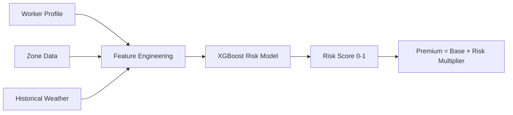
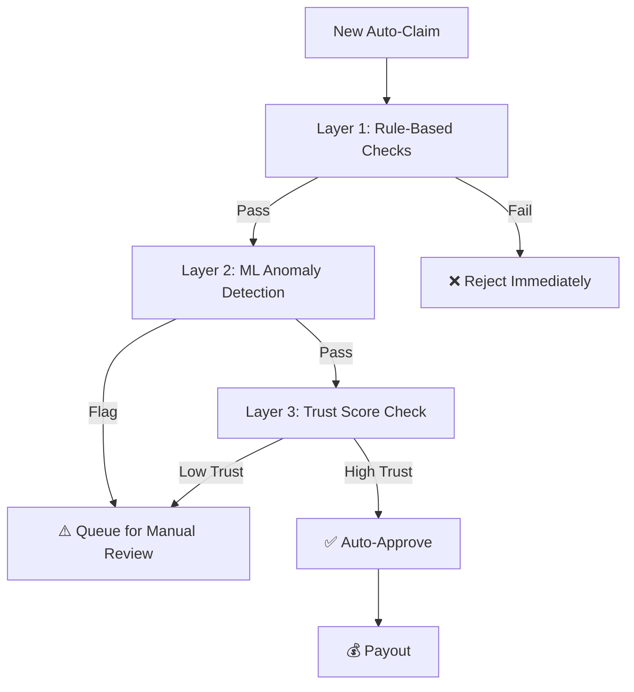

# 🤖 AI/ML Integration Plan — Zoink-4-u

## Overview

AI/ML is not a bolt-on for Zoink-4-u — it's the **core engine** that powers three critical capabilities:

1. **Dynamic Premium Pricing** — Personalized, fair weekly premiums
2. **Intelligent Fraud Detection** — Real-time anomaly detection on every claim  
3. **Predictive Disruption Forecasting** — Forecasting next week's risk for proactive planning

---

## Model 1: Dynamic Premium Pricing Engine

### Problem
Flat-rate insurance premiums are unfair: a worker in flood-prone Mumbai shouldn't pay the same as a worker in dry Jaipur. We need personalized, data-driven pricing.

### Approach



### Input Features

| Feature | Source | Type | Description |
|---------|--------|------|-------------|
| `zone_risk_score` | Pre-calculated | Float | Historical disruption frequency of zone (0-1) |
| `season_code` | Calendar | Categorical | Current season (monsoon, winter, summer, dry) |
| `monthly_avg_rainfall` | OpenWeatherMap | Float | Zone's avg rainfall for current month |
| `avg_aqi_30d` | WAQI | Float | Zone's 30-day average AQI |
| `worker_tenure_days` | Database | Integer | How long the worker has been on platform |
| `past_claim_count` | Database | Integer | Number of past approved claims |
| `past_claim_ratio` | Database | Float | Claims / weeks subscribed |
| `trust_score` | Trust Engine | Float | GigShield Trust Score (0-100) |
| `shift_hours` | Profile | Float | Registered daily working hours |
| `plan_tier` | Selection | Categorical | Basic / Standard / Premium |

### Model Details

| Aspect | Details |
|--------|---------|
| **Algorithm** | XGBoost Regressor |
| **Target Variable** | Expected claim probability (0-1) for the upcoming week |
| **Training Data** | Synthetic dataset: 10,000 worker-weeks with simulated claims based on real weather patterns |
| **Output** | Risk probability → mapped to premium via: `Premium = Base_Rate × (1 + risk_prob × max_multiplier)` |
| **Retraining** | Weekly batch job with latest claim + weather data |
| **Fallback** | If model fails, use rule-based formula: `Base × Zone_Factor × Season_Factor × Trust_Factor` |

### Premium Calculation Pipeline

```python
# Simplified pseudocode
def calculate_premium(worker_id, plan_tier):
    # 1. Gather features
    features = get_worker_features(worker_id)
    
    # 2. ML prediction
    risk_score = xgboost_model.predict(features)  # 0.0 to 1.0
    
    # 3. Map to premium
    base_rates = {"basic": 29, "standard": 40, "premium": 55}
    base = base_rates[plan_tier]
    
    # Premium ranges from 0.8x to 1.8x of base
    multiplier = 0.8 + (risk_score * 1.0)
    premium = round(base * multiplier)
    
    # 4. Apply trust discount (up to 15% off for high trust)
    trust_discount = max(0.85, 1 - (features.trust_score / 1000))
    final_premium = round(premium * trust_discount)
    
    return {
        "weekly_premium": final_premium,
        "risk_score": risk_score,
        "base_rate": base,
        "multiplier": multiplier,
        "trust_discount": trust_discount
    }
```

### Validation Strategy
- **A/B test** (simulated): Compare ML-priced vs flat-rate premiums on synthetic data
- **Fairness check**: Ensure no systematic bias against specific zones or new workers
- **Accuracy metric**: MAE between predicted claims and actual claims (target < 0.15)

---

## Model 2: Fraud Detection Engine

### Problem
Parametric insurance is vulnerable to fraud: fake location data, claiming during non-disruption periods, duplicate claims. We need multi-layer real-time fraud detection.

### Architecture



### Layer 1: Rule-Based Filters (Fast, Deterministic)

| Rule | Logic | Catches |
|------|-------|---------|
| Weather Cross-Check | Was there actually a qualifying event at claimed zone + time? | Basic fake claims |
| Duplicate Check | Same worker + same event_id already has a claim? | Double-dipping |
| Coverage Check | Does the worker have an active, paid policy? | Expired policy claims |
| Cooldown Check | Last claim was < 6 hours ago from same worker? | Rapid-fire fraud |
| Zone Boundary | Worker's GPS within registered zone boundary? | Wrong-zone claims |

### Layer 2: ML Anomaly Detection

| Aspect | Details |
|--------|---------|
| **Algorithm** | Isolation Forest |
| **Input Features** | claim_frequency, avg_payout, zone_peer_comparison, gps_consistency_score, claim_timing_pattern |
| **Output** | Anomaly score (-1 to 1); > 0.7 = suspicious |
| **Training** | Trained on synthetic "normal" claim patterns; anomalies are outliers |
| **Speed** | < 100ms inference time — must not delay payout pipeline |

```python
# Pseudocode for fraud check
def check_fraud(claim_data):
    # Layer 1: Rules
    if not verify_weather(claim_data.zone, claim_data.time):
        return {"status": "rejected", "reason": "no_qualifying_event"}
    
    if has_duplicate(claim_data.worker_id, claim_data.event_id):
        return {"status": "rejected", "reason": "duplicate_claim"}
    
    if not check_gps_in_zone(claim_data.gps, claim_data.zone):
        return {"status": "rejected", "reason": "gps_outside_zone"}
    
    # Layer 2: ML
    features = extract_fraud_features(claim_data)
    anomaly_score = isolation_forest.predict(features)
    
    if anomaly_score > 0.7:
        return {"status": "flagged", "score": anomaly_score}
    
    # Layer 3: Trust
    trust = get_trust_score(claim_data.worker_id)
    if trust < 40:
        return {"status": "flagged", "reason": "low_trust_score"}
    
    return {"status": "approved", "fraud_score": anomaly_score}
```

### Key Fraud Scenarios Detected

| Scenario | Detection Method |
|----------|-----------------|
| GPS spoofing (fake location app) | GPS trajectory analysis — teleportation detection |
| Claiming on clear days | Weather API cross-check with zone + timestamp |
| Colluding workers (organized fraud) | Cluster analysis on claim patterns across linked accounts |
| Repeated micro-claims | Frequency analysis vs zone average |
| New account fraud | Low tenure + high claim rate = elevated scrutiny |

---

## Model 3: GigShield Trust Score Engine

### Problem
We need a **dynamic reputation system** that rewards honest workers and penalizes suspicious ones — creating a long-term incentive for genuine claims.

### Score Calculation

```
Trust Score = min(100, max(0, 
    base_score 
    + tenure_bonus 
    + claim_ratio_factor 
    + fraud_flag_penalty 
    + consistency_bonus
))

Where:
  base_score           = 50 (all workers start here)
  tenure_bonus         = min(20, tenure_months × 2)
  claim_ratio_factor   = max(-30, (zone_avg_rate - personal_rate) × 50)
  fraud_flag_penalty   = flagged_claims × (-15)
  consistency_bonus    = consecutive_clean_months × 3 (max 15)
```

### Trust Score Tiers

| Tier | Score Range | Behavior |
|------|------------|----------|
| 🟢 **Trusted** | 70-100 | Instant auto-approval, premium discounts |
| 🟡 **Standard** | 40-69 | Normal processing, standard premiums |
| 🔴 **Watch** | 0-39 | All claims manually reviewed, no premium discounts |

### Score Impact on User Experience

| Event | Score Change |
|-------|-------------|
| Week completed with no fraudulent activity | +2 |
| Legitimate claim approved & paid | +1 |
| Claim flagged but later approved manually | +0 (no penalty) |
| Claim rejected for fraud | -15 |
| Consecutive 4 clean weeks | +5 bonus |
| Account confirmed as fraudulent | Score → 0, policy cancelled |

---

## Model 4: Disruption Forecaster

### Problem  
Reactive insurance only kicks in after disruption. **Proactive forecasting** lets us plan better: suggest enhanced coverage, prepare for high-claim weeks, adjust pricing dynamically.

### Approach

| Aspect | Details |
|--------|---------|
| **Algorithm** | LSTM (Long Short-Term Memory) time-series model |
| **Input** | 90-day weather history per zone (daily: rainfall, temperature, AQI, humidity) |
| **Output** | Per-zone disruption probability for each of the next 7 days |
| **Granularity** | Zone-level (pincode) |
| **Update Frequency** | Daily batch prediction |

### Use Cases

| Consumer | What They See |
|----------|-------------|
| **Workers** | "⚠️ 70% chance of heavy rain on Tuesday. Consider enhanced coverage!" |
| **Admins** | "Expected 45 claims next week across Mumbai zones. Reserve ₹18,000" |
| **Pricing Engine** | Dynamic adjustment: high forecast → slight premium increase for new subscriptions |

### Implementation Plan

| Phase | What We Build |
|-------|--------------|
| **Phase 1 (now)** | Rule-based forecasting using weather forecast APIs (7-day forecasts) |
| **Phase 2** | Train LSTM on historical data, show predictions alongside API forecasts |
| **Phase 3** | Full ML-driven forecasting with confidence intervals |

---

## Data Strategy

### Training Data Sources

| Data | Source | Real / Synthetic |
|------|--------|-----------------|
| Weather history | OpenWeatherMap API (free: 5 calls/min) | **Real** |
| AQI history | WAQI API (free tier) | **Real** |
| Worker profiles | Generated based on real gig worker demographics | Synthetic |
| Delivery earnings | Based on published average earnings data | Synthetic |
| Claim patterns | Simulated based on weather → disruption correlation | Synthetic |
| Fraud patterns | Modeled after known insurance fraud scenarios | Synthetic |

### Synthetic Data Generation Plan

```python
# Generate 10,000 worker-weeks of training data
for worker in synthetic_workers:
    for week in 52_weeks:
        weather = get_historical_weather(worker.zone, week)
        disruption = simulate_disruption(weather)
        
        if disruption:
            claim = simulate_claim(worker, disruption)
            fraud = simulate_fraud_attempt(probability=0.05)
        
        record = {
            "features": extract_features(worker, weather, week),
            "claim_happened": disruption,
            "claim_amount": claim.amount if claim else 0,
            "is_fraud": fraud
        }
        training_data.append(record)
```

---

## Implementation Timeline

| Phase | AI Component | Approach |
|-------|-------------|----------|
| **Phase 1** (Week 1-2) | Premium pricing | Rule-based formula (documented above) |
| **Phase 1** (Week 1-2) | Disruption forecast | Weather forecast API integration (7-day) |
| **Phase 2** (Week 3-4) | Premium pricing | XGBoost model trained on synthetic data |
| **Phase 2** (Week 3-4) | Fraud detection | Rule-based filters + basic Isolation Forest |
| **Phase 2** (Week 3-4) | Trust scoring | Heuristic formula implementation |
| **Phase 3** (Week 5-6) | Fraud detection | Enhanced ML model with more features |
| **Phase 3** (Week 5-6) | Disruption forecast | LSTM time-series model |
| **Phase 3** (Week 5-6) | Personalization | Coverage recommendation engine |

---

## Tech Stack for AI Layer

| Component | Technology |
|-----------|-----------|
| API Framework | Python FastAPI |
| ML Models | scikit-learn, XGBoost |
| Time-series | TensorFlow/Keras (LSTM) |
| Data Processing | pandas, numpy |
| Model Serving | Direct FastAPI endpoints |
| Model Storage | joblib / pickle files |
| Monitoring | Custom logging + admin dashboard metrics |
