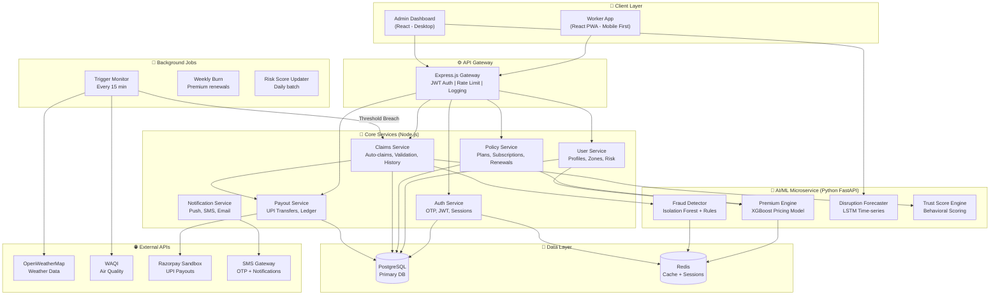
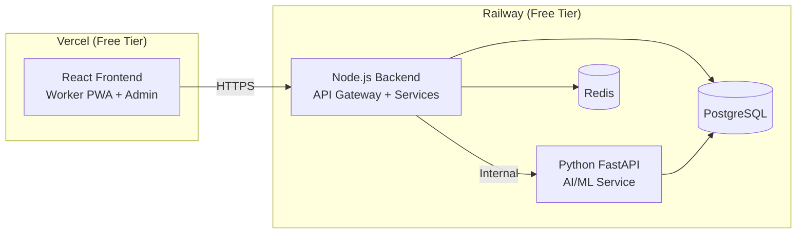

# 🏗️ System Architecture — Zoink-4-u

## Overview

Zoink-4-u follows a **microservice-inspired modular architecture** with clear separation of concerns. The system has 4 primary layers:

1. **Client Layer** — Worker PWA + Admin Dashboard
2. **API Gateway** — Request routing, auth, rate-limiting
3. **Service Layer** — Business logic (policies, claims, payouts)
4. **AI/ML Layer** — Python microservice for ML models

---

## High-Level Architecture



---

## Component Details

### 1. Client Layer

#### Worker PWA (Progressive Web App)
- **Framework:** React.js + Vite
- **Design:** Mobile-first responsive
- **Key Screens:**
  - Onboarding / Registration
  - Dashboard (active coverage, recent payouts)
  - Plan selection & payment
  - Claims history
  - Profile & zone settings

#### Admin Dashboard
- **Framework:** React.js + Vite (shared component library)
- **Key Screens:**
  - Live metrics overview
  - Active disruption alerts
  - Fraud review queue
  - Policy & payout analytics
  - Zone risk management
  - Predictive forecasting view

---

### 2. API Gateway (Express.js)

```
Responsibilities:
├── JWT token validation
├── Role-based access control (Worker / Admin)
├── Request rate limiting
├── Request logging & monitoring
├── CORS configuration
└── API versioning (/api/v1/...)
```

#### Key API Routes

| Method | Route | Service | Description |
|--------|-------|---------|-------------|
| POST | `/auth/register` | Auth | Worker registration with OTP |
| POST | `/auth/login` | Auth | Phone + OTP login |
| GET | `/users/profile` | User | Get worker profile & risk score |
| PUT | `/users/zone` | User | Update operating zone |
| GET | `/policies/plans` | Policy | List available plans |
| POST | `/policies/subscribe` | Policy | Subscribe to a plan |
| GET | `/policies/active` | Policy | Get active policy |
| GET | `/claims/history` | Claims | Past claims list |
| GET | `/claims/:id` | Claims | Claim details |
| POST | `/admin/trigger` | Claims | Manual trigger (admin) |
| GET | `/admin/dashboard` | Multiple | Dashboard aggregated data |
| GET | `/admin/fraud-queue` | Claims | Flagged claims for review |
| GET | `/analytics/forecast` | AI | Disruption forecast |

---

### 3. Core Services (Node.js)

#### Auth Service
- OTP-based registration (phone number)
- JWT access + refresh tokens
- Session management via Redis
- Role-based: `worker` / `admin`

#### User Service
- Worker profile management
- Zone selection & shift hours
- Risk profile storage
- zoink-4-u Trust Score tracking

#### Policy Service
- Plan catalog (Basic / Standard / Premium)
- Subscription creation & management
- Weekly auto-renewal logic
- Coverage status tracking
- Calls Premium Engine for personalized pricing

#### Claims Service
- **Auto-claim initiation:** Receives trigger events from the monitor
- **Validation pipeline:** Calls Fraud Detector + Trust Score
- **Claim lifecycle:** `triggered → validating → approved/rejected → paid`
- **Manual claims:** Admin review queue for flagged claims

#### Payout Service
- Razorpay sandbox integration for UPI payouts
- Payout ledger (all transactions recorded)
- Retry logic for failed transfers
- Weekly payout reports

#### Notification Service
- Push notifications (via Firebase or similar)
- SMS alerts for critical events (claim approved, payout sent)
- Email notifications for admin alerts

---

### 4. AI/ML Layer (Python FastAPI)

Runs as a separate microservice to keep ML dependencies isolated.

| Endpoint | Model | Input | Output |
|----------|-------|-------|--------|
| `POST /premium/calculate` | XGBoost | Zone, season, tenure, trust score | Premium amount (₹) |
| `POST /fraud/check` | Isolation Forest + Rules | Claim data, GPS, weather | Fraud score (0-1) |
| `POST /trust/update` | Heuristic + ML | Claim history, behavior | Trust score (0-100) |
| `GET /forecast/:zone` | LSTM | Zone ID, historical data | 7-day disruption probability |

---

### 5. Data Layer

#### PostgreSQL Schema (Key Tables)

```sql
-- Workers
workers (id, phone, name, platform, zone_id, shift_hours, 
         trust_score, created_at)

-- Zones
zones (id, name, pincode, city, state, risk_score, 
       lat, lng, radius_km)

-- Policies
policies (id, worker_id, plan_tier, premium_amount, 
          start_date, end_date, status, auto_renew)

-- Claims
claims (id, policy_id, worker_id, trigger_type, event_id,
        event_start, event_end, lost_hours, payout_amount,
        fraud_score, status, created_at)

-- Trigger Events
trigger_events (id, zone_id, trigger_type, threshold_value,
                actual_value, start_time, end_time, 
                data_source, created_at)

-- Payouts
payouts (id, claim_id, worker_id, amount, payment_method,
         transaction_id, status, processed_at)

-- Fraud Logs
fraud_logs (id, claim_id, check_type, result, details,
            created_at)
```

#### Redis Usage
- Session tokens (TTL: 24 hours)
- Cached zone risk scores (TTL: 1 hour)
- Rate limiting counters
- Recent weather data cache (TTL: 15 min)

---

### 6. Background Jobs

#### Trigger Monitor (Every 15 minutes)
```
1. Poll OpenWeatherMap for all active zones
2. Poll WAQI for AQI data
3. For each zone:
   a. Check against trigger thresholds
   b. If threshold breached → Create trigger event
   c. Find all active policies in zone
   d. For each policy → Initiate auto-claim
```

#### Weekly Renewal Job (Every Sunday)
```
1. Find all policies expiring today with auto_renew=true
2. Check worker's payment method
3. Process renewal payment
4. Extend coverage by 7 days
5. Send renewal confirmation notification
```

#### Risk Score Updater (Daily)
```
1. Aggregate past 90 days of weather data per zone
2. Recalculate zone risk scores
3. Update zone risk_score in database
4. Flag zones with significant risk changes
```

---

## Deployment Architecture



### Why This Stack?

| Choice | Reason |
|--------|--------|
| Vercel for frontend | Zero-config React deployment, free SSL, fast CDN |
| Railway for backend | Supports Node + Python, free PostgreSQL & Redis addons |
| Separate AI service | ML dependencies (numpy, sklearn) isolated from Node.js |
| PostgreSQL over MongoDB | Relational data (policies, claims) benefits from joins & constraints |
| Redis for caching | Real-time weather data caching, session management |

---

## Security Considerations

| Layer | Measure |
|-------|---------|
| Auth | JWT with short expiry (15 min access, 7 day refresh) |
| API | Rate limiting (100 req/min per user) |
| Data | All PII encrypted at rest |
| Payments | Razorpay handles sensitive payment data (PCI compliant) |
| CORS | Strict origin whitelist |
| Input | Zod/Joi validation on all endpoints |

---

## Scalability Path

For the hackathon, we start simple. But the architecture is designed to scale:

| Current (Hackathon) | Future (Production) |
|---------------------|-------------------|
| Single Railway instance | Kubernetes cluster |
| PostgreSQL single instance | PostgreSQL with read replicas |
| 15-min weather polling | WebSocket real-time weather feeds |
| Razorpay sandbox | Production UPI integration |
| Python FastAPI single process | GPU-backed ML inference service |
