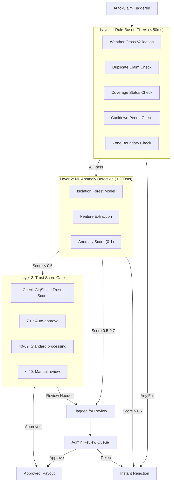

# Fraud Detection Strategy - Zoink-4-u

## Why Fraud Detection Is Critical

Parametric insurance is powerful because it's automated, but automation creates fraud opportunities:

| Fraud Type | Risk Level | Impact If Undetected |
|-----------|-----------|---------------------|
| GPS spoofing (fake location) | High | Worker claims for a zone they're not in |
| Claiming on clear days | High | Free money for non-events |
| Duplicate claims | Medium | Same event paid multiple times |
| Inflated shift hours | Medium | Higher payouts than entitled |
| Organized fraud rings | High | Multiple accounts, systematic theft |
| Identity fraud | Medium | Fake accounts claiming repeatedly |

Our goal is to block fraudulent claims automatically while ensuring legitimate workers get paid instantly with zero friction.

---

## Multi-Layer Defense Architecture



---

## Layer 1: Rule-Based Filters

These are fast, deterministic checks that run in under 50ms. They catch obvious fraud before the ML model even needs to run.

### Check 1: Weather Cross-Validation

Purpose: Verify that a qualifying weather event actually occurred at the claimed location and time.

```python
def validate_weather(zone_id, trigger_type, claimed_time):
    """Cross-check claimed event against weather API data"""
    
    # Get actual weather data for the zone at claimed time
    weather = get_historical_weather(zone_id, claimed_time)
    
    thresholds = {
        "heavy_rainfall": lambda w: w["rain_1h"] > 40,
        "severe_aqi": lambda w: w["aqi"] > 350,
        "extreme_heat": lambda w: w["temp"] > 45,
        "flood": lambda w: w["rain_12h"] > 150,
    }
    
    check_fn = thresholds.get(trigger_type)
    if not check_fn:
        return {"valid": False, "reason": "unknown_trigger_type"}
    
    if check_fn(weather):
        return {"valid": True, "actual_value": weather}
    else:
        return {"valid": False, "reason": "no_qualifying_event",
                "actual": weather, "required": thresholds[trigger_type]}
```

### Check 2: Duplicate Claim Prevention

Purpose: Ensure the same worker can't get paid twice for the same event.

```python
def check_duplicate(worker_id, event_id):
    """Check for existing claim on same event"""
    existing = db.claims.find_one({
        "worker_id": worker_id,
        "event_id": event_id,
        "status": {"$in": ["approved", "processing", "paid"]}
    })
    
    return {
        "is_duplicate": existing is not None,
        "existing_claim_id": existing["id"] if existing else None
    }
```

### Check 3: Coverage Status

Purpose: Confirm the worker has a valid, paid, active policy.

| Check | Pass Condition |
|-------|---------------|
| Policy exists | Worker has a policy record |
| Policy active | Status = "active" |
| Policy not expired | end_date > current_time |
| Payment current | Last payment successful |

### Check 4: Cooldown Period

Purpose: Prevent rapid-fire claims from the same worker.

| Rule | Value |
|------|-------|
| Minimum gap between claims | 6 hours |
| Maximum claims per day | 2 |
| Maximum claims per week | 4 |

### Check 5: Zone Boundary

Purpose: Verify the worker's GPS data places them within their registered zone.

```python
def validate_zone(worker_gps, registered_zone):
    """Check if worker's GPS coordinates are within their zone"""
    zone_center = (registered_zone["lat"], registered_zone["lng"])
    zone_radius = registered_zone["radius_km"]
    
    distance = haversine(worker_gps, zone_center)
    
    # Allow 2km buffer for GPS inaccuracy
    return {
        "in_zone": distance <= zone_radius + 2,
        "distance_km": distance,
        "zone_radius": zone_radius
    }
```

---

## Layer 2: ML Anomaly Detection

### Isolation Forest Model

The Isolation Forest detects outliers in worker claim patterns. Normal workers cluster together; fraudulent behavior creates anomalies.

#### Input Features

| Feature | Description | Why It Matters |
|---------|------------|---------------|
| `claim_frequency_7d` | Claims in past 7 days | Excessive claiming pattern |
| `claim_frequency_30d` | Claims in past 30 days | Sustained anomaly |
| `avg_payout_amount` | Average payout per claim | Inflated claims |
| `zone_peer_ratio` | Worker's claim rate vs zone average | Claims more than neighbors? |
| `gps_consistency` | Standard deviation of GPS readings | Spoofing creates erratic patterns |
| `claim_timing_variance` | Variance in time-of-day of claims | Always claiming at odd hours? |
| `weather_correlation` | How strongly claims match weather events | Low correlation = suspicious |
| `shift_overlap_ratio` | Claimed hours vs registered shift overlap | Claiming outside registered hours |

#### Model Training

```python
from sklearn.ensemble import IsolationForest
import numpy as np

# Train on "normal" worker behavior (synthetic data)
normal_data = generate_normal_claims(n_workers=5000, n_weeks=52)

features = extract_features(normal_data)
# Features: [claim_freq, avg_payout, peer_ratio, gps_consistency, 
#            timing_variance, weather_corr, shift_overlap]

model = IsolationForest(
    n_estimators=200,
    contamination=0.05,  # Assume 5% normal data is borderline
    random_state=42
)
model.fit(features)

# Scoring: Lower score = more anomalous
# Score < -0.5 -> Highly suspicious (anomaly_score > 0.75)
# Score -0.5 to 0 -> Moderately suspicious (anomaly_score 0.5-0.75)
# Score > 0 -> Normal behavior (anomaly_score < 0.5)
```

#### Score Interpretation

| Anomaly Score | Category | Action |
|--------------|----------|--------|
| 0.0 to 0.3 | Normal | Auto-approve (proceed to Layer 3) |
| 0.3 to 0.5 | Mild anomaly | Auto-approve but log for monitoring |
| 0.5 to 0.7 | Suspicious | Flag for admin review |
| 0.7 to 1.0 | Highly anomalous | Auto-reject + admin alert |

---

## Layer 3: GigShield Trust Score

A dynamic reputation score that evolves with worker behavior over time.

### Score Components

```
Trust Score = clamp(0, 100,
    50 (base)
    + tenure_bonus (0 to +20)
    + clean_record_bonus (0 to +15)
    + fraud_penalty (0 to -50)
    + claim_behavior_factor (-15 to +10)
    + community_factor (0 to +5)
)
```

| Component | Calculation | Range |
|-----------|------------|-------|
| Base Score | All workers start at 50 | 50 |
| Tenure Bonus | +2 per month, max +20 | 0 to +20 |
| Clean Record | +3 per consecutive clean month (no fraud flags) | 0 to +15 |
| Fraud Penalty | -15 per fraud flag; -50 for confirmed fraud | 0 to -50 |
| Claim Behavior | Compared to zone peers; excessive claiming = negative | -15 to +10 |
| Community | Bonus for verified identity, referrals | 0 to +5 |

### Trust Tiers and Impact

| Tier | Score | Claim Processing | Premium Impact |
|------|-------|-----------------|----------------|
| Trusted | 70-100 | Instant auto-approve | Up to 15% discount |
| Standard | 40-69 | Normal ML pipeline | Standard pricing |
| Watch | 0-39 | All claims go to manual review | No discounts |
| Banned | Confirmed fraud | Account suspended | N/A |

---

## Specific Fraud Scenarios and Detection

### Scenario A: GPS Spoofing

Attack: Worker uses a GPS spoofing app to fake their location in a rain-affected zone while they're actually in a clear-weather area.

Detection:
1. GPS trajectory analysis: Real GPS shows smooth movement; spoofed GPS shows teleportation (sudden jumps)
2. Cell tower triangulation (if available): Doesn't match GPS coordinates
3. Peer cross-reference: If only one worker claims disruption in a zone where 50 workers are registered, it's suspicious
4. Historical pattern: Worker has GPS data from a different area most of the week but claims disruption in registered zone

```python
def detect_gps_spoofing(worker_id, claimed_time):
    gps_trail = get_gps_history(worker_id, 
                                 start=claimed_time - hours(6),
                                 end=claimed_time)
    
    # Check for teleportation (jump > 5km in < 5 min)
    for i in range(1, len(gps_trail)):
        distance = haversine(gps_trail[i], gps_trail[i-1])
        time_diff = gps_trail[i].time - gps_trail[i-1].time
        
        if distance > 5 and time_diff < timedelta(minutes=5):
            return {"spoofing_detected": True, 
                    "type": "teleportation",
                    "distance_km": distance,
                    "time_gap_min": time_diff.minutes}
    
    return {"spoofing_detected": False}
```

### Scenario B: Organized Fraud Ring

Attack: Group of workers coordinate fake claims. One creates fake disruption reports, all others claim from the same "event."

Detection:
1. Cluster analysis: Identify groups of workers who always claim together
2. Registration pattern: If 5 workers registered from the same IP/device within a week, flag the group
3. Payout destination: Multiple workers' UPI accounts linked to the same bank account
4. Referral chain: Long referral chains where all members claim far above average

### Scenario C: Inflated Shift Hours

Attack: Worker registers 12+ hours/day to maximize payout when disruptions occur.

Detection:
1. Platform earnings cross-check: Declared hours should roughly match estimated deliveries
2. Peer comparison: Compare declared hours to zone average
3. Automatic cap: Maximum 10 hours/day for Premium tier, regardless of declaration

---

## Admin Review Dashboard

### Fraud Queue View

```
+-----------------------------------------------------------+
|  Fraud Review Queue - 3 Items Pending                      |
|                                                            |
|  +---------------------------------------------------------+
|  | CLAIM #1247 - Anomaly Score: 0.68                       |
|  | Worker: Suresh K. | Zone: Andheri West                  |
|  | Trigger: Heavy Rain | Payout: Rs. 450                   |
|  | Flag: claim_frequency_7d = 4 (zone avg: 0.8)            |
|  | Trust Score: 42 (Standard)                               |
|  | [Approve] [Reject] [Investigate]                         |
|  +---------------------------------------------------------+
|                                                            |
|  +---------------------------------------------------------+
|  | CLAIM #1251 - Anomaly Score: 0.82                       |
|  | Worker: Anonymous | Zone: Lajpat Nagar                  |
|  | Trigger: Severe AQI | Payout: Rs. 560                   |
|  | Flag: GPS inconsistency (possible spoofing)              |
|  | Trust Score: 28 (Watch)                                  |
|  | [Approve] [Reject] [Investigate]                         |
|  +---------------------------------------------------------+
+-----------------------------------------------------------+
```

### Key Admin Metrics

| Metric | Description |
|--------|-------------|
| Fraud Detection Rate | % of detected/prevented fraudulent claims |
| False Positive Rate | % of legitimate claims incorrectly flagged (< 5% target) |
| Average Review Time | Time for admin to resolve flagged claims |
| Loss Ratio Impact | How much fraud detection saves on claim payouts |
| Trust Score Distribution | Histogram of worker trust scores |

---

## Implementation Timeline

| Phase | What We Build | Approach |
|-------|--------------|----------|
| Phase 1 | Basic weather cross-validation | Rule-based |
| Phase 2 | Full Layer 1 rules + basic Isolation Forest | Rules + ML v1 |
| Phase 2 | Trust Score system (heuristic) | Formula-based |
| Phase 3 | Enhanced ML model with more features | ML v2 |
| Phase 3 | GPS spoofing detection | ML + rules |
| Phase 3 | Admin fraud review dashboard | Full UI |
| Phase 3 | Fraud analytics and reporting | Dashboard |
